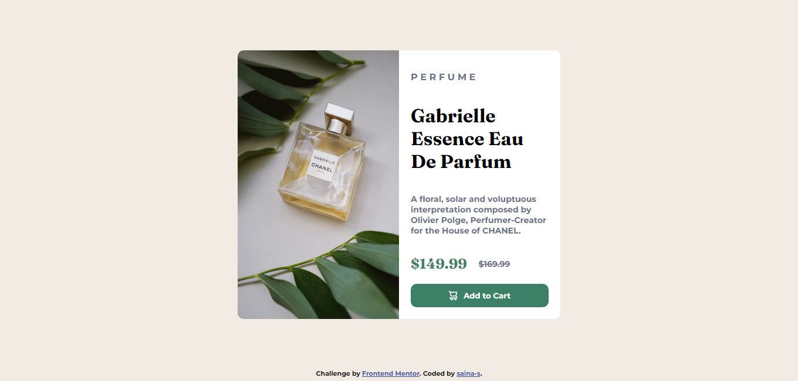

# Product-preview-card-component
This is a solution to the [Product preview card component challenge on Frontend Mentor](https://www.frontendmentor.io/challenges/product-preview-card-component-GO7UmttRfa).

## Table of contents

- [Overview](#overview)
  - [Screenshot](#screenshot)
  - [Links](#links)
- [My process](#my-process)
  - [Built with](#built-with)
  - [Useful resources](#useful-resources)
- [Author](#author)

### Screenshot

### Links

- Live Site URL: (https://saina-s.github.io/Product-preview-card-component/)

### Built with

- HTML5
- CSS 
- Flexbox
- Mobile-first workflow

- ### Useful resources

- [resource](https://stackoverflow.com/questions/28966158/changing-image-depending-on-mobile-or-desktop-html-css) - This helped me for putting two different image on mobile and desktop. I really liked this pattern and will use it going forward.

- ## Author

- linkedin [saina soltani](https://www.linkedin.com/in/saina-soltani-a9273a1b5/?originalSubdomain=ir)

